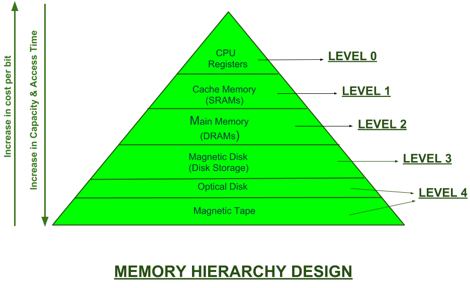
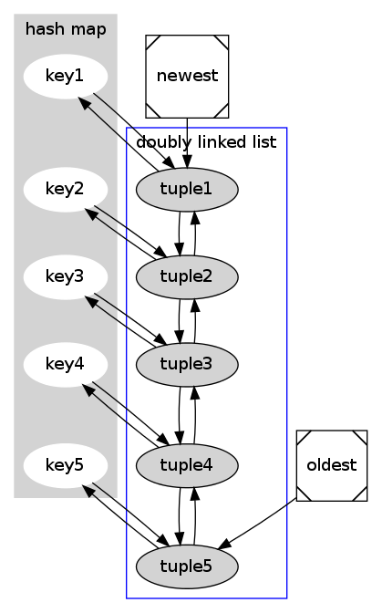
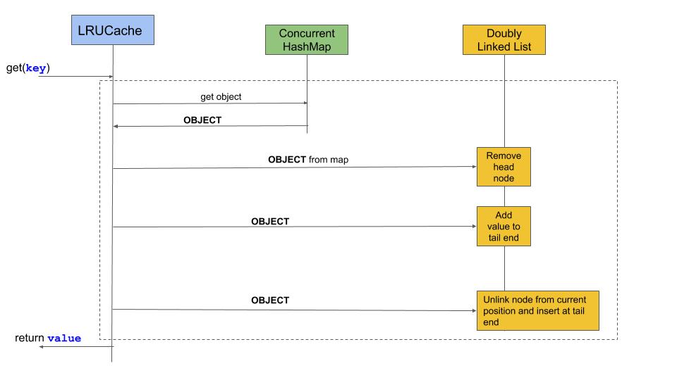
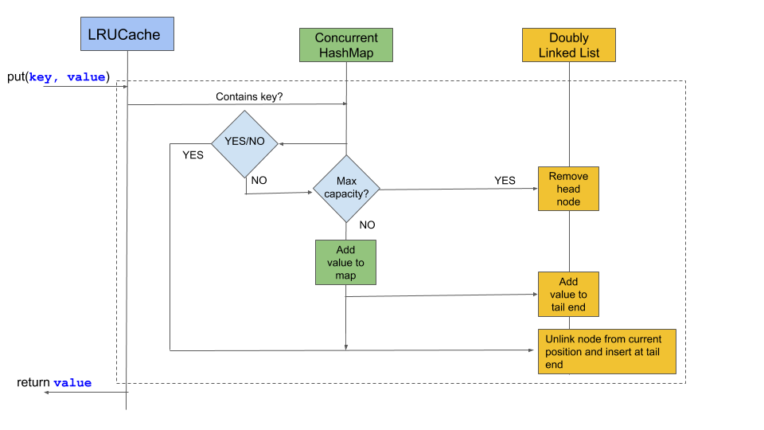

# Introduction

When hearing the word **Cache** the first thing that comes into normal people’s mind is money, but what all the Computer Geeks hear and understand is a place where computer stores recently used information.

To respect the sentiments of the Computer Geeks, let's define it in a standard course of action given below:-

> *Caching* refers to the use of a faster medium to prevent a slower medium from slowing down the performance of a computer.

Certain components, like the CPU, have a small amount of physical cache memory built into them so that they can quickly access the information they need, rather than waiting for the information to be sent to them through the busses.

In this microbyte, we will commence by a small Case Study of Caching in real life so the laymen can relate to it, learn LRU Algorithm through visual representation ( *talk less show more* ) methodology, and explore the application of cache in computer systems like Linux Page Cache and DNS Cache. 

**Let's dive in!!**

# Pre-requisites
1. Before starting, make sure you are logged in as a user with sudo privileges on your *systemd driven* Linux machine.
2. Install `dnsutils` package if not present.
3. A prior knowledge of using Linux commands is a must skill in order to procceed further.

    Don't know where to start with learning Linux commands ?  Checkout the amazing Linux Crio Bytes at the [Crio.Do](https://crio.do).
    I have **cached**  the URL of Linux Bytes mentioned below :-) 

    1. [Linux Basics 1](https://learn.crio.do/home/me/ME_LINUX1)
    2. [Linux Basics 2](https://learn.crio.do/home/me/ME_LINUX2)

4. Learner must have basic knowledge of data structures and problem solving skills and a will to learn.

# Case Study: - Caching in daily life


> Visual Credits:- [GeeksForGeeks](https://geeksforgeeks.org)

Don't curse me for the above diagram. It will be needed for explaining the real world relationship of caching concepts with computer memory hierarchy. Sit tight and enjoy the show!!

Let's assume you would like to purchase something for your special ones.

Your money can be stored in three places: (Click on arrow to reveal)
<details>
    <summary>Your pocket (cache)</summary>

```
The easiest and quickest way to get access to your money is if you already
have money in your pockets. If this is the case, you can pay and immediately
 receive your item. 

However, your pockets do not have much space for money and any money found 
 in your pockets is removed when you wash your pants. 

Cache works in the same way in that it is the quickest way to store small 
 amounts of data but is cleared frequently.
```
  </details>

<details>
    <summary>Your wallet (RAM)</summary>

```
While a wallet allows you to store more money (generally, enough money to do
 shopping), it also takes more effort to look for this money. 

In the same way, RAM generally allows you to store the data you will need at
 any time but does not allow you to permanently store your data.
```
  </details>

<details>
    <summary>Your bank account (Disk Storage)</summary>

```
The slowest way to get access to your money is to go to the bank, but it allows
 you to store much larger amounts of money.

As a result, whenever you make a big purchase (such as a house or a car), you 
will need to go to the bank. 

In a similar way, your hard drive is much slower than either RAM or your cache,
 but it also allows you to permanently store thousands of times more data.
```

  </details>

I hope we now have a clear idea and can relate it with the computer memory.

Let's bring on some activities!!!

But before that try to solve the Micro challenge below:- 

> Micro-Challenge:- List down 2-3 scenarios like discussed above which describes the relationship between computer memory hierarchy and daily activities in real life.

# Activities
## Activity 1 - Coding Challenge [LRU Cache](https://leetcode.com/problems/lru-cache/)

---

Click the Problem Statement link which is attached to above heading, read it thoroughly and come back here later. 

Before getting started, let's list down the basic terminologies of the cache which will help to understand the problem better.

 
- <ins>Cache Entry</ins>: - A cache entry consists of a key and its mapped data value within the cache.

- <ins>Cache Hit</ins>: - When a data entry is requested from cache and the entry exists for the given key, it is referred to as a cache hit (or simply, a hit).

- <ins>Cache Miss</ins>: - When a data entry is requested from cache and the entry does not exist for the given key, it is referred to as a cache miss (or simply, a miss).

- <ins> Eviction </ins>: - The removal of entries from the cache in order to make room for newer entries (typically when the cache has run out of data storage capacity).

- <ins> Expiration </ins>: - The removal of entries from the cache after some amount of time has passed, typically as a strategy to avoid stale data in the cache.

We have 3 more terminologies to be defined: -

> ### Yet Another Question:
> What is *Hot Cache*, *Cold Cache* and *System-of-Record* in cache terminologies?

---
### Activity 1.1:- Real world interpretation of LRU Cache

---

> **A Least Recently Used (LRU) Cache** organizes items in order of use, allowing you to quickly identify which item hasn't been used for the longest amount of time.

Picture a clothes rack, where clothes are always hung up on one side. To find the least-recently used item, look at the item on the other end of the rack.

Want some help in imagining the above scenario ?

Here we go!


---
### Activity 1.2: - Identify data structures
---

Now listen to me carefully! 
- Understand the above visual interpretation in depth.
- Try to map the above arrangement with the data structures of which you have the knowledge.

    Spend as much as time thinking about the data structures applicable here in the cache.

    <details>
    <summary>Hint</summary>

    ```
        1. The shirts are arranged in linear fashion back to back 
        (Probably a linear data structure)

        2. The man can pick up any shirt from the rack. It means it has
         the knowledge of all the shirts located in the rack. ( O(1) Search capability)
    ```
    </details>

- Once you identified the appropriate data structures, try to represent in a diagram analogous to above visual interpretation. Take your time.

    <details>
    <summary>Result</summary>

    

    - The man is analogus to Hashmap whose job is to pick and put the t-shirts.
    - The doubly linked list is analogus to t-shirts arranged in linear fashion.
    </details>

---
### Activity 1.3:- Draw Sequence Diagram of LRU cache operations.
---

The problem statement mention about 2 operations which are performed on LRU cache `get` and `put`.

Dry run the testcases and try to understand the Cache hit, Cache miss and Cache eviction taking place while performing the operations.

Consider the following questions to come up with a sequence diagram

For get Operations:-

- > What actions need to be made if the element is found?
- > What action must be taken when element is not found ?

For put Operations: -
- >  What actions need to be taken if element to be inserted already exist?
- > What actions need to be taken to insert the element ?
- > What actions need to be taken if max capacity is reached during insert ?

Try to brainstorm on the above conditions and come up with a sequence diagram.

<details>
    <summary>Sequence Diagram</summary>
For get operation: -



For put operation: -



</details>

---
### Activity 1.4:- Submit the solution
---

Congratulations! You came up with a sequence diagram.

Now we have a clear flow of the operations and have covered edge cases too.

You can submit the solution in your prefered language and come back here later. (Java would be a great option though)

Let's dive into the next activities.


---
## Activity 2 - Linux Page Cache
---
### What is Page Cache? 

The linux file system cache (Page Cache) is used to make IO operations faster. 

Let's understand it in simple way.

- **PageCache** is cached files. 

- Files that were recently accessed are stored in the RAM so they will not need to be queried from the hard disk again, unless that file changes or the cache is cleared to make room for other data. 

- This puts less read and write impact on a hard drive and increases speed since files can be read from RAM much faster.

How can we check the RAM usage of Page Cache ? Let's start with this sub-activity.

---
### Activity 2.1 - Page Cache Memory Usage
---
- We'll use a popular linux command `free` to display the memory usage.

    > $ free -m

    Output: -

    ```
                   total       used        free      shared  buff/cache   available
    Mem:           7436        3748         819         700        2868        2760
    Swap:          2047           0        2047

    ```

    > Curious Question: What is -m flag in free command? What are the other available flags?

    After seeing the buff/cache value, my reaction was like:-


> Visual credits: linuxatemyram.com

I was scared and started looking for solutions to clear cache like an idiot. Then I stumbled upon this beautiful website [linuxatemyram.com](linuxatemyram.com).

This website have such a great answer which gave me a partial relief when I found out it's completely normal.

I was still curious how Page cache helps in improving performance of IO operations.

We'll find out the results in the next activity : )

---
### Activity 2.2 - Experimental Verification
---

- Before we start with the experiment, we need to find out a way to clear the buffer cache and here comes another linux command to our rescue.

    **Proc Sys VM Drop Caches Command**( What a weird name!!)

    Let's try this command in root login mode.

    > $ echo 1 > /proc/sys/vm/drop_caches 

    Execute this command on your linux machine.

    > **Yet Another Curious Question:**
    > Why value 1 is passed into the command? Can we pass any number like 2 or 3 ?

- Let's check our memory usage again using `free`.

    Output: -
    ```
                   total        used        free      shared  buff/cache   available

    Mem:           7436        1297        5556          64         582        5864
    Swap:          2047         475        1572
    ```
    We can see that majority of the buff/cache was freed with this command.

- Generate a 1GB file using a linux command (Now that's a micro-challlenge :)) or if you are lazy enough than you can choose any file with size 1GB available to you.

- Let's read the file and write it back to /dev/null to test the time taken to read the file from disk. We will use **time** command for to measure the time.

    > Note: Make sure all the applications are closed and only terminal is opened for optimal results.
    > Make sure cache is cleared before executing the following commands.

    Let's run the command to read the file and dump it into the sink hole.
    > $ time cat " path of file "  > /dev/null

    Output:-
    ```
    real	0m0.492s
    user	0m0.000s
    sys	0m0.357s
    ```
    Let's run the above command again and check the output.
    ```
    real	0m0.124s
    user	0m0.000s
    sys	0m0.124s
    ```
    We can see a significant drop in the read time of the file.

    > Micro-Challenge:- Try this activity with different file sizes and measure the time taken after subsequent reads. If there are any variations try to find out the reason behind it.

After trying the above activity, I was convinced that it indeed improves the performance of the machine by caching the files which are requested by the services frequently.

> Micro-Challenge: - Find out which Caching Algorithmic technique is used by the Linux Page Caching mechanism along with Cache Eviction Policy used by the kernel.


---
## Activity 3 - DNS Cache
---

### What is DNS Cache?

*DNS cache* refers to the temporary storage of information about previous DNS lookups on a machine's OS or web browser. 

Keeping a local copy of a DNS lookup allows your OS or browser to quickly retrieve it and thus a website's URL can be resolved to its corresponding IP much more efficiently.

How do I know whether DNS caching is enabled or not in my machine? Let's dive in.

--- 
### Activity 3.1 - Enabling DNS Caching temporarily
---

- To check whether DNS caching is enabled or not in your systemd driven Linux machine, we'll use a linux command. Let's **dig** in.

    > $ dig google.com 

<details>
    <summary>Output</summary>

    ```

    ; <<>> DiG 9.16.1-Ubuntu <<>> google.com
    ;; global options: +cmd
    ;; Got answer:
    ;; ->>HEADER<<- opcode: QUERY, status: NOERROR, id: 40349
    ;; flags: qr rd ra; QUERY: 1, ANSWER: 1, AUTHORITY: 0, ADDITIONAL: 1

    ;; OPT PSEUDOSECTION:
    ; EDNS: version: 0, flags:; udp: 512
    ;; QUESTION SECTION:
    ;google.com.			IN	A

    ;; ANSWER SECTION:
    google.com.		299	IN	A	172.217.26.238

    ;; Query time: 132 msec
    ;; SERVER: 8.8.8.8#53(8.8.8.8)
    ;; WHEN: Thu Oct 29 22:43:31 IST 2020
    ;; MSG SIZE  rcvd: 55

    ```
</details>

- The DNS caching is enabled if the value of `SERVER:` is anything other than `127.0.0.X.` 

- We can temporarily enable caching by restarting `systemd-resolved` which is a default DNS resolution server.

    > $ sudo systemctl restart systemd-resolved

- Check the DNS server IP again using `dig google.com` and we'shall see in the format `127.0.0.X`. which indicates caching is enabled.

---
### Activity 3.2 - Caching DNS queries.
---
- We can check the Cache statistics of the DNS resolver using following command:-

    > $ sudo systemd-resolve --statistics 

<details>
    <summary>Output</summary>

```
    DNSSEC supported by current servers: no

    Transactions           
        Current Transactions: 0
          Total Transactions: 0
                       
    Cache                  
        Current Cache Size: 0
                Cache Hits: 0
              Cache Misses: 0
                       
    DNSSEC Verdicts        
               Secure: 0
             Insecure: 0
                Bogus: 0
        Indeterminate: 0

```

The values are becomes zero after every restart of `systemd-resolved`
</details>

-  Dig google.com twice or thrice and check it's query time and also check Cache statistics of system-d resolved.

    Did you noticed something strange?

    The domain IP address was cached and was reflected in the statistics.

> Micro-Challenge:- Dig out multiple domain address and see the response time and the statistics. You will definitly have fun.


---

### Activity 3.3 - Displaying Cached DNS resolved queries.

---

So far we're able to get cache statistics but are still disappointed as we don't know how to display cached records. Let's begin with this fun activity.

> Note: Make sure you have dig up different domains to obtain more cached values.

Here's the magic command:

- >$ sudo killall -USR1 systemd-resolved
- >$ sudo journalctl -u systemd-resolved.service > ~/resolved.txt 
- > $ cat ~/resolved.txt

The resolved cache domain can be found in nextline of `CACHE:` keyword.

Yeah!!. We finally displayed the cached data.


> Curious Question: What is the significance of `-USR1` in the above magic command ?

> ### Yet another Micro-Challenge:
> Find out how cache eviction policy is implemented in systemd-resolved DNS resolver. 

> It will be a challenging task but definitly worth it to go for it.


---
# Conclusion

Congratulations!! You made it. That was a quite a daunting and amazing ride!. Check out the following references to learn more about the Caching and it's usage in the computing world.

---
# References

- [LRU Cache data structure](https://www.interviewcake.com/concept/java/lru-cache)
- [Cache in Java With LRU Eviction Policy](https://dzone.com/articles/java-based-simple-cache-lru-eviction)
- [How to Clear Cache on Linux](https://linuxhint.com/clear_cache_linux/)
- [Linux Ate My RAM](https://www.linuxatemyram.com/)
- [How To Clear Or Flush DNS Cache In Linux](https://ostechnix.com/how-to-clear-or-flush-dns-cache-in-linux/)
- [How can I see systemd-resolve dns cache?](https://askubuntu.com/questions/1257831/how-can-i-see-systemd-resolve-dns-cache)


    


   


