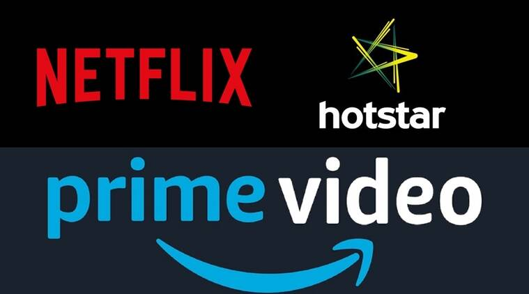
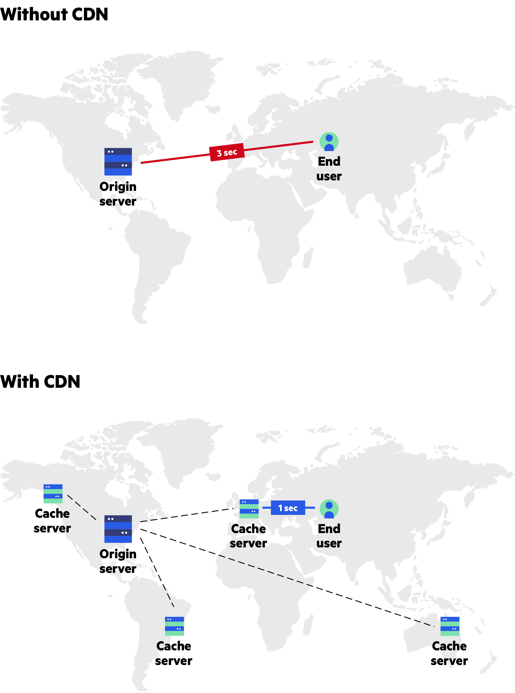
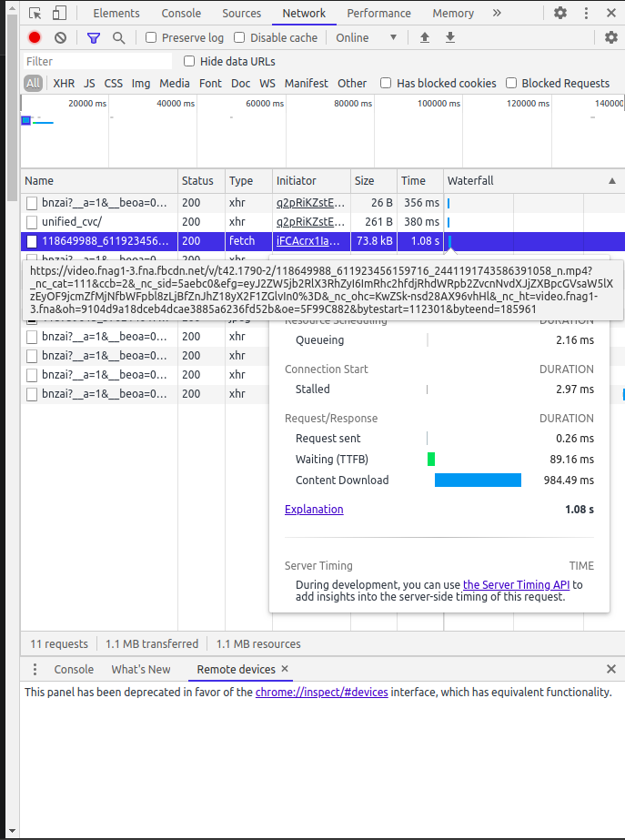
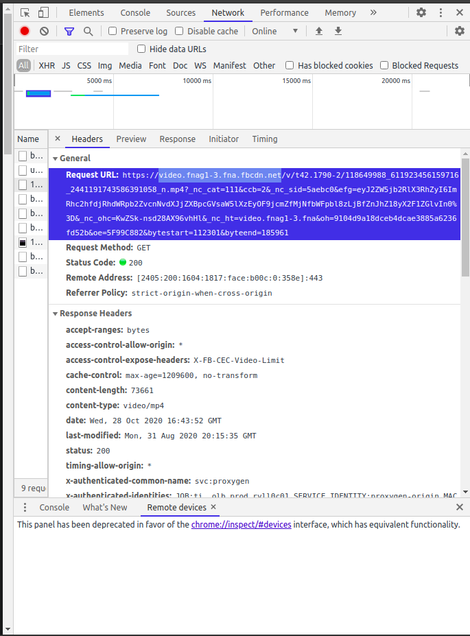

# Introduction

Entertainment content has always had humans hooked from the very beginnings of mankind. We all love to binge watch web series like Breaking Bad, Money Heist, Stranger things, The Boys, Scam 1992 etc on respective platforms like Netflix, Amazon Prime, Sony Liv,etc. Did it ever occured in our mind how the OTT platorm are able to provide their content so blazingly fast without any interruption across the globe ?



The Internet is a constantly-changing mechanism, and new forms of data and content are constantly being created. Soon after it was made commercially available, the problem of pushing massive amounts of data to the end user as fast as possible had to be solved. **Enter CDNs.**

**A Content Delivery Network (CDN) is a globally distributed network of web servers or Points of Presence (PoP) whose purpose is to provide faster content delivery.**

The content is replicated and stored throughout the CDN so the user can access the data that is stored at a location that is geographically closest to the user. This is different (and more efficient) than the traditional method of storing content on just one, central server.

A client accesses a copy of the data near to the client, as opposed to all clients accessing the same central server, in order to avoid bottlenecks near that server. If it isn’t available, the CDN will query the back-end servers for the file, cache it locally, and serve it to the requesting user.


 
> Visual Credits: imperva.com

The above visual representation summarizes it pretty well.

In this microbyte, we will be learning to identify how CDN's play an important role for serving massive contents in Facebook, identify the rough locations of server and practically serving our simple content through CDN. Let's dive in!!

---

# Pre-requisites

- Before starting, make sure you are logged in as a user with sudo privileges on your Linux machine and have a Chromium based web browser like Chrome,Edge,Chromium,etc.
A prior knowledge of  using Chrome Developer Tools is recommended to have.
It's not compulsory but you can access the learning material for Chrome Developer tools at Crio.do and the links are mentioned below:-

    1. [Chrome Developer Tools : Part 1](https://learn.crio.do/home/me/ME_DEVELOPER_TOOLS)

    2. [Chrome Developer Tools : Part 2](https://learn.crio.do/home/me/ME_DEVELOPER_TOOLS_II)

- Any VPN Chrome extension (preferably [BrowSec VPN](https://browsec.com/) ) must be installed.
> Don't be scared. We will be needing VPN for rightful purpose.
- A network tools like `curl` and `nslookup` must be installed in the machine.
---
# Activities

## Activity 1 - Setup Tools
---

- Before the commencement of this activity, try to find answer of the following question. 

    > ### Yet Another Random Question:
    >  How did Tiktok succeed to gather massive userbase in short amount of time ? ( We know they serve cringy contents XD which activates the neurons of many people but how did they deliver it? )

- Below is the video link of the widely popular channel World Health Organization (WHO):-

    [Facebook - We are 8 months into the COVID-19 pandemic](https://www.facebook.com/watch/?v=370278504371023) 

- Open the above video link in the new tab of Chrome browser with Chrome Developer Tools opened and Browsec VPN extension activated.

    > *Note:-* Press `Ctrl+Shift+I` to open Chrome Developer Tools

- Make sure the webpage is fully loaded and don't the play the video. We'll do that but right now have patience.

- Select the `Network` Tab and clear all the network logs by pressing :no_entry_sign:. So Yeah! we have the setup ready and let's start the digging information for which we're waiting for so long.

- Let's jump to next activity were we will do something unprecedented.

---
## Activity 2 - Extracting CDN server IPs from a Facebook video.
---

1. Press on the Play button of the video. Wait for 3-4 secs and click on the Pause button. (Please only press Pause button and no where else!!)

    <details>
    <summary>Click to see the results</summary>

    The network logs must look something like this: -

    > Note: The result below won't be same for you but the format might be similar.


    
    </details>


2. Hover over the network logs and find a single log whose request URL consists of  `video` and `fbcdn` and click on it to display HTTP Headers. 

    <details>
    <summary>Click to see the results</summary>

    The HTTP Header must look something like this: -

    > Note: The result below won't be same for you but the format might be similar.


    
    </details>


    >Curious Question:  What is Key `cache-control` in the Response Header and how does it play it's role in CDN ?

3. Copy the domain URL (in my case `video.fnag1-3.fna.fbcdn.net`) and store it in your sticky notepad or anything you prefer.

4. Open new tab and change the location to any country using VPN extension( in my case `Browsec VPN`) and open the video in this tab with the same setup explained in `Activity-1`

    >Note: Don't close the previous tab, let it be open.

5. Repeat the steps from 1 to 4 and store all the domain URLs and mark them with the respective country you collected from.

    If you carried out the above tasks successfully, select the correct option your collected data indicates.

    - [ ] Same domain URL for each and every country.
    - [ ] Different URL for each and every country.

    <details>
     <summary>Click to see the correct answer</summary>

     Different URL for each and every country.
    
    </details>

    You might be wondering why we're collecting this URL's and thinking it might be waste of efforts. Buckle up, things are about to get excited.

---

## Activity 3 - Digging up approximate locations of the CDN servers.

---

- Before the commencement of this activity, try to find answer of the following question.

    > ### Yet Another Random Question: 
    > How To Find Out the complete information about a Domain name? 

- Get the IP address of all the collected domain URLs and note it down respective to each country. There is a linux command which does it for you :)

    <details>
     <summary>Hint</summary>
    Read the pre-requisite once again :)
    </details>

- Get and Store the City name and Geo-location of each and every IP address obtained by making a `curl` request as given below:-

    ``` 
    $ curl ipinfo.io/< IP Address > 
    ```
    > You might think that why do we only get a single city name from a whole goddamn country. The reason is the Facebook CDN server tries to serve the VPN server located nearby to it.

    >**Micro-Challenge**- Try the steps from Activity 2 till here with a different VPN service provider and list down the City names and check if they are similar with the previous result or not.

---
## Activity 4 - Showcase your results
---
Now it's time to finally make some sense of the data which we have collected so far. This will be a total fun activity.

- Go to your favorite Maps Service and place the marker of all the co-ordinates from the data obtained.

- You might be surprised with the location of the CDN servers all around the globe serving content and improving the user experience with their services.

    What are the benefits of using a **CDN**? Good Question!

    Let me give you an answer in 3 words.

<details>
     <summary>Here's the answer.</summary>


Jokes apart: Here's the professional answer

> - Faster content load / response time in delivering content to end users.
> - Availability and scalability, because CDNs can be integrated with cloud models
> - Redundancy in content, thus minimizing errors and there is no need for additional expensive hardware
> - Enhanced user experience with CDNs as they can handle peak time loads
Data integrity and privacy concerns are addressed
> - Creating a better market reach across the globe. (Now This is business)
</details>

---
## Activity 5 - Hand's On with CDN
---
> Can we serve our own content through CDN? Sure why not!

> Wanna Try? Sure
> 1. Login to Crio.Do 
> 2. Start [System Design Micro-Experience](https://learn.crio.do/home/me/ME_QPREP_SD).
> 3. Complete till module 3
> 4. Start module 4 which is dedicated to practical hand's on CDN.
> 5. Congrats! for completing the Micro Experience.

---
# Mega Challenge
> Now we have a pretty much understanding of CDN. Try the above steps for your favourite OTT platform - **Netflix**


---
# Conclusion
Congratulations!! You made it. That was a quite a daunting and amazing ride!. Check out the following references to learn more about the architectural place of CDN in System Design.

---
# References

[Content Delivery Explained](https://www.globaldots.com/content-delivery-network-explained)

[The Essential CDN Guide](https://www.imperva.com/learn/performance/cdn-guide/)

[Business Benefits of CDN](http://www.ctrls.in/blog/content-delivery-network-and-its-business-benefits/)


